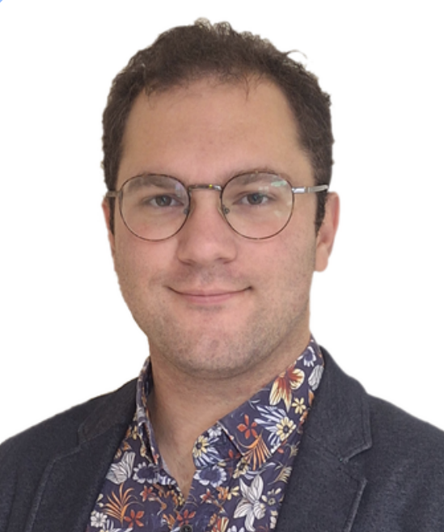

{ .profile-photo }

# Aras Selahiye

### Photonics and Data Engineer

Dual MSc: Optics & Photonics + Computer Science · Machine learning for imaging · Health & defence R&D

[:material-file-download: Download CV (PDF)](assets/Aras_SELAHIYE_CV_EN.pdf){ .md-button .md-button--primary }
[:material-email: Contact](contact.md){ .md-button }
[:material-play-circle-outline: Live demos](demos/index.md){ .md-button }

+33 (0)7 82 39 24 76 · [aras.selahiye@hotmail.com](mailto:aras.selahiye@hotmail.com) · [linkedin/aras-selahiye](https://fr.linkedin.com/in/aras-selahiye-667079134) · [github.com/Alltairas](https://github.com/Alltairas)

Strasbourg, France · Turkish citizen · Military service: completed

Turkish (native) · English C1 (TOEIC 910/990) · French C1 (French Baccalauréat) · Spanish A2 (DELE)

Physicist working where optical systems meet machine learning. Two research placements from 2025 to 2026 building
polarimetric imaging for the diagnosis of conditions associated with preterm birth: Mueller-matrix reconstruction
pipelines on clinical data, and deep-learning models trained on medical images. Earlier, electro-optic test and
calibration at a Turkish defence electro-optics manufacturer, including boresight alignment on thermal imaging
systems. Works on full detector build-up, LabVIEW acquisition, and large-scale image processing in Python and
MATLAB.

## Professional Experience

### Polarimetric Imaging Reconstruction & Data Pipeline, Research Intern
**ICube TRIO, UMR 7357 CNRS** · Strasbourg, France · Apr to Sep 2026

- Refactored a legacy MATLAB package into a Mueller polarimetric imaging reconstruction pipeline for biomarker
  extraction, with a Python metadata layer, on a clinical dataset of 97 patients.
- Designed a statistical validation framework quantifying inter-calibration drift.
- Built a semantic segmentation model for polarimetric images, distinguishing cervix epithelial types.

:material-file-document-outline: [Mueller-matrix reconstruction and biomarker extraction for cervical tissue](https://drive.google.com/file/d/1RD9jjvR2I5S9LohQI7koc1HDJ3aqIAGA/view?usp=sharing){: target="_blank" } — M2 defence slides (Google Drive)
{ .report-link }

### Polarimetric Imaging & Deep Learning, Research Intern
**Poladerme Deep Skin Reading**, startup owned by ARCHOS group · Strasbourg, France · Mar to Sep 2025

- Trained and benchmarked CNN backbones with transfer learning (EfficientNet-B6/B7, EfficientNetV2-L, ConvNeXt-L,
  ResNet-50) for cancer lesion classification on 4× NVIDIA A100 GPUs, GPU-accelerated and parallelised, developed
  toward a polarimetric imaging device.
- Built a data pipeline over 74,000+ medical images from public sources with metadata integration; preprocessing
  optimisation cut runtime 30× versus prior implementations.
- Ran a correlation study linking polarimetric parameters to Mueller matrix coefficients.

:material-file-document-outline: [Searching the best CNN Model for image classification of cancerous skin lesions](https://www.researchgate.net/publication/395742260_Searching_the_best_CNN_Model_for_image_classification_of_cancerous_skin_lesions){: target="_blank" } — ResearchGate
{ .report-link }

### Computational Physics & Deep Learning on STM Imaging, Research Intern
**Institut Lumière Matière, UMR 5306 CNRS** · Lyon, France · Feb to Aug 2024

- Delivered an interactive tool identifying borophene allotropes from experimental STM images.
- Ran DFT and molecular-dynamics computation in VASP; automated deep-learning workflows over MD data in Python
  and Bash.

:material-file-document-outline: [Training a Neural Network for Bypassing Density Functional Theory computations](https://www.researchgate.net/publication/385172716_Subject_Training_a_Neural_Network_for_Bypassing_Density_Functional_Theory_computations){: target="_blank" } — ResearchGate
{ .report-link }

### Opto-Electronic Detector Development & Photothermal Spectroscopy, Scientific Assistant (Intern)
**Institut Lumière Matière, UMR 5306 CNRS** · Lyon, France · May to Jun 2022

- Designed and built an opto-electronic detector for photothermal deflection spectroscopy, quantifying probe-beam
  displacement.
- Implemented instrument interfacing and data acquisition in LabVIEW.

:material-file-document-outline: [Designing a Photothermal Deflection Detector](https://www.researchgate.net/publication/385172650_Designing_a_Photothermal_Deflection_Detector){: target="_blank" } — ResearchGate
{ .report-link }

### Electro-Optic System Test & Calibration, Optics R&D Intern
**Transvaro Electron Tools**, defence electro-optics (thermal imagers, weapon sights) · Istanbul, Türkiye · Jun to Jul 2021

- Calibrated opto-electronic systems using a collimator and Infratest software.
- Set up a measurement environment for Minimum Resolvable Temperature Difference (MRTD), Non-Uniformity
  Correction (NUC) and boresight alignment testing; organised inter-company meetings to resolve software issues.

## Education

| Degree | Institution | Years |
|---|---|---|
| MSc Computer Science: Complementary Skills In Informatics | University Claude Bernard Lyon 1, Villeurbanne, France | 2025 to 2026 |
| MSc Physics: Fundamental & Applied Physics, major in Optics & Photonics | University Claude Bernard Lyon 1, Villeurbanne, France | 2022 to 2024 |
| BSc: Science, Technology & Health, Physics track | University Claude Bernard Lyon 1, Villeurbanne, France | 2016 to 2021 |

**Optics:** lenses, filters, detectors, spectrometers, geometric / wave / Fresnel optics, optical instrumentation and
spectroscopy. **Laser physics:** optical cavities, Gaussian beams, ultrafast and non-linear optics. **Experimental:**
bench component calibration and alignment; microscopy (confocal, STED, SPIM, FRAP); AI for physics.

## Technical Skills

| | |
|---|---|
| **Optics & instrumentation** | Optical component calibration and alignment · opto-electronic detector design and build-up · Mueller-matrix polarimetry · photothermal deflection spectroscopy · collimator setups · laser physics · spectrometers and detectors · LabVIEW instrument control and data acquisition |
| **Imaging & machine learning** | PyTorch, TensorFlow, Keras, scikit-learn, OpenCV · CNN transfer learning · semantic segmentation · multi-GPU training (NVIDIA A100) · Hugging Face · Fourier theory, frequency-domain filtering |
| **Programming & computation** | Python (NumPy, pandas, Matplotlib) · MATLAB / Simulink · C++ · Java · Bash · VASP (DFT, molecular dynamics) · PostgreSQL · pgadmin · Docker · Git · Linux / WSL · UML / Merise systems modelling (Modelio, Papyrus) · Arduino, Raspberry Pi, PID control · Wireshark |
| **Extracurricular** | Improv - clown · Fablab (electronics) Uni society member · Yoga · Cycling · Sailing · Scuba Diving (PADI) |
